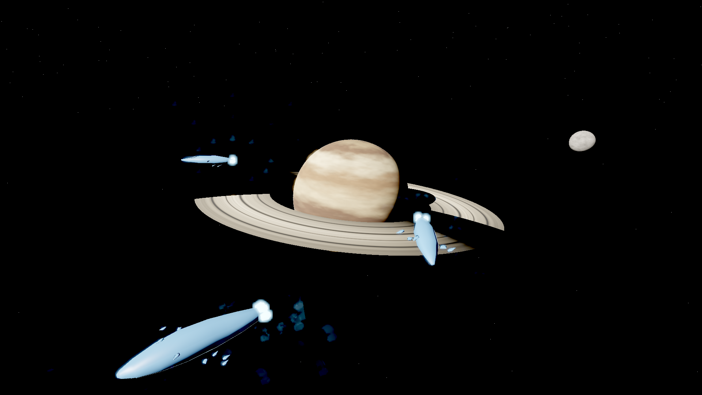

# Stellar Dominion

A space scene authored entirely through the engine's own `rekall.*` command
surface — no scene JSON was hand-edited. Built as an assessment of how well an
LLM agent can author with the CLI/MCP tooling; the findings are in
`docs/research/2026-08-28-agent-authoring-evaluation.md`.



## What is in it

- **Meridian** — a banded gas giant with a procedurally textured surface, a
  structured ring system, and a Rayleigh/Mie/ozone scattering atmosphere.
- **Kell** — a textured moon.
- An 8,000-star field with a Milky Way band.
- A sun driving both the key light and the bloom.
- Three capital ships with procedurally lofted hulls and separate emissive drive
  blocks, plus twenty fighters flying inclined patrol orbits around them.
- A `lensDirt` post-process pass scattering the bloom the way grime on a lens does.

Fleet motion lives in `Modules/FleetRules`: capitals integrate along their
heading with the fixed step's `DeltaTime`, while fighter orbits are solved
absolutely from `ElapsedTime` so a wing cannot drift out of phase.

## Rebuilding it

Textures are generated rather than committed — `Examples/**/Assets/texture/` is
gitignored — so regenerate and re-import them first. The asset ids below are the
ones the scene references; re-importing the same files reproduces them.

```bash
# 1. Procedural textures (gas giant bands, moon, ring density strip)
python Examples/StellarDominion/Tools/textures.py

# 2. Import them into the project's asset catalog
for t in gasgiant moon rings; do
  dotnet run --project src/Rekall.Age.Cli -c Release -- \
    asset import Examples/StellarDominion <scratch>/tex_$t.png texture "tex_$t"
done

# 3. Build and apply the scene blueprint over MCP
#    (the CLI's `command execute` cannot carry this payload - see the evaluation doc)
python Examples/StellarDominion/Tools/build_scene.py > scene.json
python Examples/StellarDominion/Tools/mcp_client.py rekall.scene.apply_blueprint scene.json

# 4. Build the fleet module so the runtime will load it
dotnet run --project src/Rekall.Age.Cli -c Release -- build modules Examples/StellarDominion

# 5. Capture. The `vulkan` argument matters: the default backend is a software
#    rasterizer with no atmosphere, bloom or tonemapping.
dotnet run --project src/Rekall.Age.Cli -c Release -- \
  render viewport capture Examples/StellarDominion Main 45 out 1920 1080 vulkan
```

`Tools/build_scene.py` carries the lighting notes worth knowing before changing
the shot — in particular that the sun's *phase angle* (sun-planet-camera), not
its angle from the view axis, is what decides how much of the planet is lit, and
that an unlit face receives no ambient at all.
