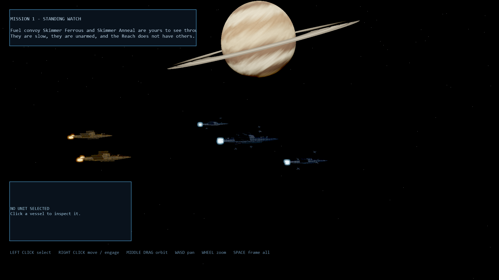

# Stellar Dominion

A space scene authored entirely through the engine's own `rekall.*` command
surface — no scene JSON was hand-edited. Built as an assessment of how well an
LLM agent can author with the CLI/MCP tooling; the findings are in
`docs/research/2026-08-28-agent-authoring-evaluation.md`.



## What is in it

- **Meridian** — a banded gas giant with a procedurally textured surface, a
  structured ring system, and a Rayleigh/Mie/ozone scattering atmosphere.
- **Kell** — a textured moon.
- An 8,000-star field with a Milky Way band.
- A sun driving both the key light and the bloom.
- Three capital ships with procedurally lofted hulls, chamfered hard-surface
  superstructures, UV-projected armour panels, varied metallic/roughness and
  normal response, and separate emissive drive blocks; twenty fighters fly
  inclined patrol orbits around them.
- Scalable High/60 FPS rendering intent with 4K cascaded shadows, SSAO, AgX HDR,
  restrained bloom, and automatic quality scaling.
- File-backed CC0 heavy-beam and impact reports, spatialized at fleet scale.

Fleet motion lives in `Modules/FleetRules`: capitals integrate along their
heading with the fixed step's `DeltaTime`, while fighter orbits are solved
absolutely from `ElapsedTime` so a wing cannot drift out of phase.

## The game

`MainMenu → Intro → Mission1 → Debrief → MainMenu` is a complete loop.

- **Main menu** with an MP3 track that fades with the screen.
- **Intro** — the prologue typed a character at a time, skippable.
- **Settings** — rows that read and write a `Rekall.PersistentState` slot.
- **Mission 1, "Standing Watch"** — left-click selects a vessel and fills the unit
  readout; right-click orders it to move, or to engage whatever is under the
  cursor. Weapons fire on a cycle inside their range, shields absorb and
  regenerate, hulls do not heal, and a destroyed hull stops being a unit. The
  Hollow Choir acquires the nearest Compact warship and closes. Clearing the
  picket wins; losing the flagship — a hull later missions need — ends the
  campaign outright, which is the rule for every story-critical vessel.
- **Debrief** — reads what the mission wrote into the `campaign` state slot,
  since the battle's world is gone by the time it runs.

```bash
# Author the mission and the debrief, then prove the combat chain headlessly.
python Examples/StellarDominion/Tools/build_mission.py <scratch>
python Examples/StellarDominion/Tools/mcp_client.py \
  rekall.scene.apply_blueprint <scratch>/scene_Mission1.json \
  rekall.scene.apply_blueprint <scratch>/scene_Debrief.json
python Examples/StellarDominion/Tools/verify_mission.py
python Examples/StellarDominion/Tools/verify_beam_tracking.py
python Examples/StellarDominion/Tools/verify_weapon_audio.py
```

`verify_mission.py` runs four cases — quiet, victory, defeat and debrief — as
runtime assertions, so a regression fails the command instead of needing someone
to read numbers out of a dump. It deliberately does not cover issuing an order
with the mouse: that path runs through the player's input bridge, which headless
inspection bypasses entirely, and has to be exercised in the player.

The two smaller probes are regressions for defects found in live play. The beam
probe proves that a moving emitter and its local-space beam advance by the same
fixed-step delta; the audio probe makes the real combat system fire and requires
the imported heavy-beam WAV to be playing with nonzero spatial gains.

## Rebuilding it

Textures are generated rather than committed — `Examples/**/Assets/texture/` is
gitignored — so regenerate and re-import them first. The asset ids below are the
ones the scene references; re-importing the same files reproduces them.

```bash
# 1. Procedural textures (gas giant bands, moon, ring density strip)
python Examples/StellarDominion/Tools/textures.py

# 2. Import them into the project's asset catalog
for t in gasgiant moon rings; do
  dotnet run --project src/Rekall.Age.Cli -c Release -- \
    asset import Examples/StellarDominion <scratch>/tex_$t.png texture "tex_$t"
done

# 3. Build and apply the scene blueprint over MCP
#    (the CLI's `command execute` cannot carry this payload - see the evaluation doc)
python Examples/StellarDominion/Tools/build_scene.py > scene.json
python Examples/StellarDominion/Tools/mcp_client.py rekall.scene.apply_blueprint scene.json

# 4. Build the fleet module so the runtime will load it
dotnet run --project src/Rekall.Age.Cli -c Release -- build modules Examples/StellarDominion

# 5. Capture. The `vulkan` argument matters: the default backend is a software
#    rasterizer with no atmosphere, bloom or tonemapping.
dotnet run --project src/Rekall.Age.Cli -c Release -- \
  render viewport capture Examples/StellarDominion Main 45 out 1920 1080 vulkan
```

`Tools/build_scene.py` carries the lighting notes worth knowing before changing
the shot — in particular that the sun's *phase angle* (sun-planet-camera), not
its angle from the view axis, is what decides how much of the planet is lit, and
that an unlit face receives no ambient at all.
